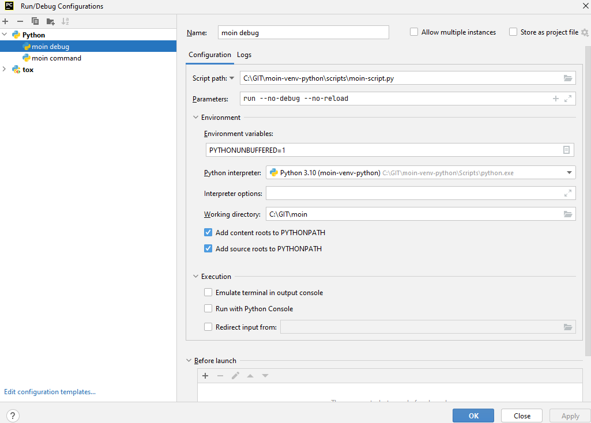
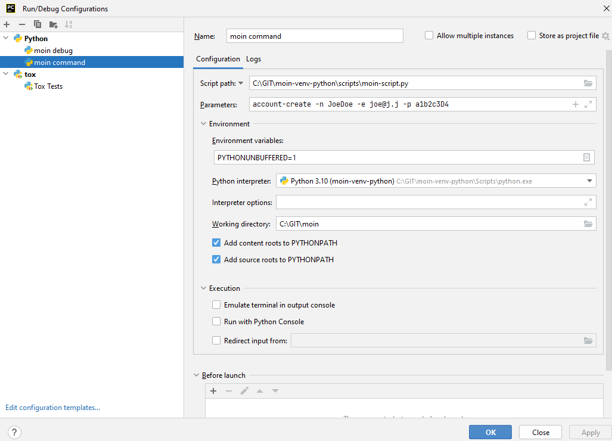
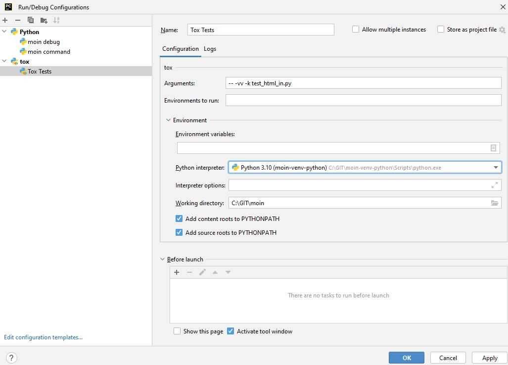

===========
Development
===========

Useful Resources
================

IRC channels on chat.freenode.net (quick communication and discussion):

* #moin-dev  (core development topics)
* #moin  (user support, extensions)

Wikis:

* https://moinmo.in/  (production wiki, using moin 1.9)

Documentation (installation, configuration, user docs, api reference):

* https://moin-20.readthedocs.io/en/latest/

Repository, Issue tracker (bugs, proposals, todo), Code Review, etc.:

* https://github.com/moinwiki/moin

Requirements for development
============================

The `virtualenv` Python package is required.
The installation process for `virtualenv` varies with your OS and Python distribution.
Many linux distributions have a package manager that may do the installation.
Windows users (and perhaps others) may download setuptools from https://pypi.org/project/setuptools/.
Once setuptools is installed, do "`easy_install virtualenv`".
Current ActiveState distributions include virtualenv in the installation bundle.
If all else fails, try your favorite search engine.

git is required should you wish to contribute patches to the moin2 development effort.
Even if you do not intend to contribute, git is highly recommended as it
will make it easy for you to obtain fixes and enhancements from the moin2 repositories.
git can be installed with most linux package managers or downloaded from https://git-scm.com/.
You can also find GUI clients there.

Typical development workflow
============================

This is the typical workflow for anyone that wants to contribute to the development of Moin2.

create your development environment
-----------------------------------

* if you do not have a github account, create one at https://github.com/
* fork the main repository: https://github.com/moinwiki/moin to your gh user
* clone your gh repo to your local development machine::

    cd <parent_directory_of_your_future_repo>
    git clone https://github.com/yourname/moin.git
* cd to repo root::

    cd moin
* create the virtualenv and download packages::

    python quickinstall.py
* activate virtualenv::

    . activate  # Windows: activate
* create a wiki instance and load help data and welcome pages::

    moin create-instance --full
* start the built-in server::

    moin run
* point your browser at http://127.0.0.1:5000/ to access your development wiki
* key ctrl+C to stop the built-in server

add more tools, exercise tools
------------------------------

* install additional software that developers may require::

    ./m extras  # Windows: m extras

* run the unit tests, note any existing test failures::

    ./m tests  # Windows: m tests

* install NodeJS and NPM with Linux package manager; Windows users may download both from https://nodejs.org/download/

  * On Ubuntu 14.04 or any distribution based on Ubuntu you need to install "npm" and "nodejs-legacy" (to get the "node" command).

* install lessc ("less" below is not a typo)::

    sudo npm install less -g  # Windows: npm install less -g
    lessc --version"  # show version number to prove it works
* regenerate CSS files::

    ./m css  # Windows: m css
    git diff  # verify nothing changed
* check for coding errors (tabs, trailing spaces, line endings, template indentation and spacing)::

    ./m coding-std  # Windows: m coding-std
    git diff  # verify nothing changed
* revert any changes from above::

    git reset --hard

* create local docs::

    ./m docs  # Windows: m docs
* install the pre-commit hook::

    pre-commit install  # pre-commit is used for code linting / auto-format
* set options on your favorite editor or IDE

  - convert tabs to 4 spaces
  - delete trailing blanks on file save
  - use unix line endings (use Windows line endings on .bat and .cmd files)
  - use mono-spaced font for editing
* if you are new to git, read about it (https://git-scm.com/book/),
  consider printing a cheatsheet
* if you want a Python IDE, try https://www.jetbrains.com/pycharm/ Free Community Edition
* join #moin-dev IRC channel; ask questions, learn what other developers are doing

review configuration options
----------------------------

* review https://moin-20.readthedocs.io/en/latest/admin/configure.html
* configure options by editing wikiconfig.py

  * set superuser privileges on at least one username
  * the default configuration options are commonly used, it is likely new bugs can be
    found by testing different options

find a task to work on
----------------------

* look at the issue tracker to find a task you can solve
* in case you find a new bug or want to work on some (non-trivial) new issue or idea that is
  not on the issue tracker, create an issue with a detailed description
* discuss your chosen task with other developers on the #moin-dev IRC
  channel
* to avoid duplicate work, add a comment on the issue tracker that you are
  working on that issue
* just before you start to code changes, bring your repo up to date::

    git checkout master       # make sure you are on master branch
    git pull mm master        # update your master branch
    git checkout -b mychange  # create a new branch "mychange"
    ...                       # implement your change
    tox                       # run the tests, fix any new failure!
    git status                # check what new files you created
    git diff                  # check what changes you did
    git add ...               # add the files you want to commit
    git commit                # commit, write a nice commit comment
    git push                  # push to your gh user's moin repo
    ...                       # go to gh moinwiki/moin and make a PR

develop a testing strategy
--------------------------

* if you fix something that had no test, first try to write a correct,
  but failing test for it, then fix the code and see a successful test
* if you implement new functionality, write tests for it first, then
  implement it
* make a plan for using a browser to test your changes; which wiki pages are
  effected, how many browsers must be tested

develop a working solution
--------------------------

* work in your local repo on your local development machine
  (be sure you work in the right branch)
* concentrate on one issue / one topic, create a clean set of changes
  (that means not doing more than needed to fix the issue, but also it
  means fixing the issue completely and everywhere)
* write good, clean, easy-to-understand code
* obey PEP-8
* do not fix or change code unrelated to your task, if you find
  unrelated bugs, create new issues on the tracker
* regularly run the unit tests ("./m tests"), the amount of failing tests
  shall not increase due to your changes

review your working solution
----------------------------

* use git diff, git status - read everything you changed - slowly, look for
  things that can be improved

  - if you have TortoiseGIT, use those graphical tools to review changes
* look for poor variable names, spelling errors in comments, accidental addition
  or deletion of blank lines, complex code without comments, missing/extra spaces
* fix everything you find before requesting feedback from others
* run tests again "./m tests"
* check for trailing spaces, line endings, template indentation "./m coding-std"
* if Javascript files were changed, run https://www.jslint.com/

publish your change
-------------------

* do some final testing - practically and using the unit tests
* commit your changes to your local repo, use a concise commit comment
  describing the change

  * while a commit message may have multiple lines, many tools show only 80 characters of the first line
  * stuff as much info as possible into those first 80 characters::

        <concise description of your change>, fixes #123

* push the changeset to your public github repo
* create a pull request so your changes will get reviewed and pulled into the
  main repository
* if you fixed an issue from the issue tracker, be sure the issue gets
  closed after your fix has been pulled into main repo.
* celebrate, loop back to "find a task to work on"

update your virtualenv
----------------------

Every week or so, do "m quickinstall" to install new releases of
dependent packages. If any new packages are installed, do a
quick check for breakages by running tests, starting the
build-in server, modify an item, etc.

MoinMoin architecture
=====================
moin2 is a WSGI application and uses:

* flask as framework

  - flask cli and click for command line interface
  - flask-babel / babel / pytz for i18n/l10n
  - flask-theme for theme switching
  - flask-caching as cache storage abstraction
* werkzeug for low level web/http page serving, debugging, builtin server, etc.
* jinja2 for templating, such as the theme and user interface
* flatland for form data processing
* EmeraldTree for xml and tree processing
* blinker for signalling
* pygments for syntax highlighting
* for stores: filesystem, sqlite3, sqlalchemy, memory
* jquery javascript lib, a simple jQuery i18n plugin `Plugin <https://github.com/recurser/jquery-i18n>`_
* CKeditor, the GUI editor for (x)html
* svgdraw as drawing tool

How MoinMoin works
==================
This is a very high level overview about how moin works. If you would like
to acquire a more in-depth understanding, please read the other docs and code.

WSGI application creation
-------------------------
First, the moin Flask application is created; see `moin.app.create_app`:

* load the configuration (app.cfg)
* register some modules that handle different parts of the functionality

  - moin.apps.frontend - most of what a normal user uses
  - moin.apps.admin - for admins
  - moin.apps.feed - feeds, e.g. atom
  - moin.apps.serve - serving some configurable static third party code
* register before/after request handlers
* initialize the cache (app.cache)
* initialize index and storage (app.storage)
* initialize the translation system
* initialize theme support

This app is then given to a WSGI compatible server somehow and will be called
by the server for each request for it.

Request processing
------------------
Let's look at how it shows a wiki item:

* the Flask app receives a GET request for /WikiItem
* Flask's routing rules determine that this request should be served by
  `moin.apps.frontend.show_item`.
* Flask calls the before request handler of this module, which:

  - sets up the user as flaskg.user - an anonymous user or logged in user
  - initializes dicts/groups as flaskg.dicts, flaskg.groups
  - initializes jinja2 environment - templating
* Flask then calls the handler function `moin.apps.frontend.show_item`,
  which:

  - creates an in-memory Item

    + by fetching the item of name "WikiItem" from storage
    + it looks at the contenttype of this item, which is stored in the metadata
    + it creates an appropriately typed Item instance, depending on the contenttype
  - calls Item._render_data() to determine what the rendered item looks like
    as HTML
  - renders the `show_item.html` template and returns the rendered item html
  - returns the result to Flask
* Flask calls the after request handler which does some cleanup
* Flask returns an appropriate response to the server

Storage
-------
Moin supports different stores, like storing directly into files /
directories, using key/value stores, using an SQL database etc, see
`moin.storage.stores`. A store is extremely simple: store a value
for a key and retrieve the value using the key + iteration over keys.

A backend is one layer above. It deals with objects that have metadata and
data, see `moin.storage.backends`.

Above that, there is miscellaneous functionality in `moin.storage.middleware` for:

* routing by namespace to some specific backend
* indexing metadata and data + comfortable and fast index-based access,
  selection and search
* protecting items by ACLs (Access Control Lists)

DOM based transformations
-------------------------
How does moin know what the HTML rendering of an item looks like?

Each Item has some contenttype that is stored in the metadata, also called
the input contenttype.
We also know what we want as output, also called the output contenttype.

Moin uses converters to transform the input data into the output data in
multiple steps. It also has a registry that knows all converters and their supported
input and output mimetypes / contenttypes.

For example, if the contenttype is `text/x-moin-wiki;charset=utf-8`, it will
find that the input converter handling this is the one defined in
`converters.moinwiki_in`. It then feeds the data of this item into this
converter. The converter parses this input and creates an in-memory `dom tree`
representation from it.

This dom tree is then transformed through multiple dom-to-dom converters for example:

* link processing
* include processing
* smileys
* macros

Finally, the dom-tree will reach the output converter, which will transform it
into the desired output format, such as `text/html`.

This is just one example of a supported transformation. There are quite a few
converters in `moin.converters` supporting different input formats,
dom-dom transformations and output formats.

Templates and Themes
--------------------
Moin uses jinja2 as its templating engine and Flask-Themes as a flask extension to
support multiple themes. There is a ``moin/templates`` directory that contains
a base set of templates designed for the Modernized theme. Other themes may
override or add to the base templates with a directory named ``themes/<theme_name>/templates``.

When rendering a template, the template is expanded within an environment of
values it can use. In addition to this general environment, parameters can
also be given directly to the render call.

Each theme has a ``static/css`` directory. Stylesheets for the Basic theme in
MoinMoin are compiled using the source ``theme.less`` file in the Basic theme's
``static/custom-less`` directory.
::

    ./m css  # Windows: m css

Internationalization in MoinMoin's JS
-------------------------------------
Any string which has to be translated and used in the JavaScript code, has to be defined
at ``moin/templates/dictionary.js``. This dictionary is loaded when the page loads and
the translation for any string can be received by passing it as a parameter to the ``_`` function,
also defined in the same file.

For example, if we add the following to ``i18n_dict`` in ``dictionary.js`` ::

    "Delete this"  : "{{  _("Delete this") }}",

The translated version of "somestring" can be accessed in the JavaScript code by ::

    var a = _("Delete this");

Testing
=======

We use pytest for automated testing. It is currently automatically installed
into your virtualenv as a dependency.

Running the tests
-----------------
To run all the tests, the easiest way is to do::

    ./m tests  # windows:  m tests

To run selected tests, activate your virtual env and invoke pytest from the
toplevel directory::

    pytest --pep8  # run all tests, including pep8 checks
    pytest -rs  # run all tests and output information about skipped tests
    pytest -k somekeyword  # run the tests matching somekeyword only
    pytest --pep8 -k pep8  # runs pep8 checks only
    pytest sometests.py  # run the tests contained in sometests.py

Tests output
------------
Most output is quite self-explanatory. The characters mean::

    . test ran OK
    s test was skipped
    E error happened while running the test
    F test failed
    x test was expected to fail (xfail)

If something goes wrong, you will also see tracebacks in stdout/stderr.

Writing tests
-------------
Writing tests with `pytest` is easy and has little overhead. Just
use the `assert` statements.

For more information, please read: https://docs.pytest.org/

IDE Setup
---------
Most MoinMoin developers use PyCharm, either the Professional
Edition or the Free Community Edition.  Choose one or the other
and follow the PyCharm setup instructions.

The screenshots below are from Windows 10, using Python 3.10 and
PyCharm Community Edition to debug Moin2 code. *nix setup is similar.

Debug a Transaction
*******************

When setting up the Run/Debug Configurations, it is important to get
the right values for the Script path, Parameters, Python interpreter,
and Working directory.  For general debugging of the moin2 code base
those parameters should be similar to:

If the parameters are correct, then the Run dropdown menu will show green
icons for run and debug. If the only choice under the Run menu is Edit Configuration,
then one of the parameters is wrong, try again. Note: Py``Charm has a tendency
to change the Working Directory field when other values are edited. Be sure it
points to the repo root.

Once the configuration is correct, load a source program, set a break point
and run the debugger. Point your browser to http://127.0.0.1:5000.

Debug a Moin Script
*******************

To debug one of the moin commands that are normally executed in a terminal window,
follow the example below. You can view the list of moin commands by activating
the virtual environment and doing a "moin --help".

Debug a Test
************
To debug a test, start by going to the Py``Charm edit configuration view.
Click the + in the upper left corner to show the popup list of configuration
types. Choose Tox, and then follow the example below for other field values.
Note the test starup will be rather slow, be patient.

Documentation
=============
Moin provides two types of documention. The Sphinx docs (https://www.sphinx-doc.org)
are written in reST markup, and have a target audience of developers and wiki admins.
The Help docs have a target audience of wiki editors and are written in markups supported by moin.

The Help docs are a minor subset of the Sphinx docs
and may be available in several languages. The Sphinx docs are available only in English.

Sphinx docs are available at https://moin-20.readthedocs.io/en/latest/ or
may be created locally on Moin wiki's installed by developers.
Documentation reST source code, example files and some other text files
are located in the `moin/docs/` directory in the source tree.

Creating local Sphinx docs
--------------------------
Sphinx can create all kinds of documentation formats. The most common are
the local HTML docs that are linked to under the User tab. To generate local docs::

    ./m docs  # Windows: m docs

Loading the Help docs
---------------------
Wiki admins must load the help docs to make them available to editors. Help docs are
located in the `moin/src/moin/help/` directory in the source tree. Most themes
will provide a link to the markup help above the edit textarea or the entire help namespace
may be accessed through the User tab. Write permission to help files is granted by default.
Wiki admins can change permissions via the ACL rules.

To load the help docs::

    moin load-help --namespace help-common  # images common to all languages
    moin load-help --namespace help-en      # English text

Multiple languages may be loaded. Current languages include::

    en

Updating the Help docs
----------------------
Developers may update the help files or add new files through the normal edit process.
When editing is complete run one or more of::

    moin maint-reduce-revisions  # updates all items in all namespaces
    moin maint-reduce-revisions -q <item-name> -n help-en --test true # lists selected items, no updates
    moin maint-reduce-revisions -q <item-name> -n help-en  # updates selected items

Dump all the English help files to the version controlled directory::

    moin dump-help -n help-en

The above command may may be useful after updating one or more files. All of the files
will be rewritten but only the changed files will be highlighted in version control.

Moin Shell
==========

While the make.py utility provides a menu of the most frequently used commands,
there may be an occasional need to access the moin shell directly::

    source <path-to-venv>/bin/activate  # or ". activate"  windows: "activate"
    moin -h                             # show help

Package Release on pypi.org and Github Releases
===============================================

* Commit or stash all versioned changes.
* Pull all updates from master repo.
* Run `./m quickinstall` to update the venv and translations.
* Run tests.
* Add a signed, annotated tag with the next release number to master branch::

    git tag -s 2.0.0a1 -m "alpha release"

* Install or upgrade release tools::

    pip install --upgrade setuptools wheel
    pip install --upgrade twine
    pip install --upgrade build

* Build the distribution and upload to pypi.org::

    py -m build > build.log 2>&1  # check build.log for errors
    py -m twine upload dist/*

* Enter ID and password or API Token as requested.

Test Build
----------

Create a new venv, install moin, create instance, start server, create item, modify and save an item::

    <python> -m venv </path/to/new/virtual/environment>
    cd </path/to/new/virtual/environment>
    source bin/activate  # or "scripts\activate" on windows
    pip install --pre moin
    moin --help  # prove it works
    # update wikiconfig.py  # default allows read-only, admins may load data
    moin create-instance --path <path/to/new/wikiconfig/dir>  # path optional, defaults to CWD
    cd <path/to/new/wikiconfig/dir>  # skip if using default CWD
    moin index-create

    moin run  # empty wiki, or do
    moin welcome  # load welcome pages (e.g. Home)
    moin load-help -n help-en # load English help
    moin load-help -n help-common # load help images
    moin run  # wiki with English help and welcome pages

Continue with Package Release
-----------------------------

Push the signed, annotated tag created above to github master::

    git push moinwiki 2.0.0a1

Create an ASCII-format detached signature named moin-2.0.0a1.tar.gz.asc::

    cd dist
    gpg --detach-sign -a moin-2.0.0a1.tar.gz
    cd ..

Follow the instructions here to update GitHub; drag & drop moin-2.0.0a1.tar.gz
and moin-2.0.0a1.tar.gz.asc to upload files area. These files serve as
a backup for the release sdist and the signature, so anybody can
verify the sdist is authentic::

    https://docs.github.com/en/repositories/releasing-projects-on-github/managing-releases-in-a-repository

Test the GitHub Release package::

    <python> -m venv </path/to/new/virtual/environment>
    cd </path/to/new/virtual/environment>
    source bin/activate  # or "scripts\activate" on windows
    pip install git+https://github.com/moinwiki/moin@2.0.0a1
    moin --help  # prove it works

Announce update on #moin, moin-devel@python.org, moin-user@python.org::

    Moinmoin 2.0.0a1 has been released on https://pypi.org/project/moin/#history
    and https://github.com/moinwiki/moin/releases. See https://moin-20.readthedocs.io/en/latest/,
    use https://github.com/moinwiki/moin/issues to report bugs.
